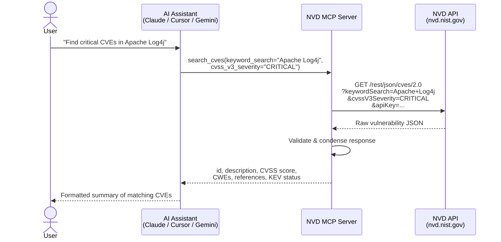

# NVD MCP Server

[](https://github.com/Alig1493/nvd-mcp-server/actions/workflows/test-nvd-api.yml)

[](https://glama.ai/mcp/servers/Alig1493/nvd-mcp-server)

A [Model Context Protocol (MCP)](https://modelcontextprotocol.io) server that lets AI assistants like Claude, Cursor, and Gemini search the [National Vulnerability Database (NVD)](https://nvd.nist.gov/) for security vulnerabilities and their change history — in plain English, no API knowledge required.

Ask your AI assistant things like:
- *"Find critical CVEs published this month"*
- *"What vulnerabilities affect OpenSSL 3.0.0?"*
- *"Look up Log4Shell"*
- *"Show me the full change history for CVE-2021-44228"*
- *"Which Log4Shell changes came from NVD analysts?"*

---

## How it works



The server sits between your AI assistant and the NVD API. It:
1. Receives natural-language-driven tool calls from the AI
2. Translates them into authenticated NVD API requests
3. Validates the raw response against strict data models
4. Returns a clean, condensed result the AI can reason about

---

## Tools

### `search_cves`

Search the NVD CVE database with any combination of filters. Returns up to 10 CVEs per page, each with id, published date, status, description, CVSS score, CWEs, top 5 references, and CISA KEV data.

### `search_cve_history`

Search the NVD CVE Change History API to see every modification made to a CVE record — description updates, CVSS score changes, CWE remaps, CPE configuration changes, KEV additions, and more. Returns a paginated list of change events with full before/after details.

---

## Prerequisites

- **Python 3.11+**
- **[uv](https://docs.astral.sh/uv/getting-started/installation/)** — fast Python package manager
- An **NVD API key** (free, takes ~1 hour to receive)

---

## Step 1 — Get an NVD API key

The NVD API is free and open, but an API key increases your rate limit from **5 requests/30 seconds** to **50 requests/30 seconds**.

1. Go to **https://nvd.nist.gov/developers/request-an-api-key**
2. Enter your email address and submit the form
3. Check your email — you'll receive your key within an hour
4. Copy the key, you'll need it in the next step

---

## Step 2 — Install the server

```bash
git clone https://github.com/Alig1493/nvd-mcp-server.git
cd nvd-mcp-server
uv sync
```

---

## Step 3 — Configure your API key

Create a `.env` file in the project root:

```bash
NVD_API_KEY=your-api-key-here
```

That's the only required setting. The NVD API URLs are pre-configured.

---

## Step 4 — Connect to your AI assistant

The server supports two transports: local **`stdio`** (spawn a process) and remote **`Streamable HTTP`** (connect over a network).

### Option A: Local Process Setup (stdio)

Great for single-user local workflows where your assistant spawns the server directly.

#### Claude Desktop

Open your Claude Desktop config file:

| OS | Path |
|----|------|
| macOS | `~/Library/Application Support/Claude/claude_desktop_config.json` |
| Windows | `%APPDATA%\Claude\claude_desktop_config.json` |

Add the following inside the `"mcpServers"` object:

```json
{
  "mcpServers": {
    "nvd-mcp-server": {
      "type": "stdio",
      "command": "uv",
      "args": [
        "--directory", "/absolute/path/to/nvd-mcp-server",
        "run", "nvd-mcp-server",
        "--transport", "stdio"
      ],
      "env": {
        "NVD_API_KEY": "your-api-key-here"
      }
    }
  }
}
```

Replace `/absolute/path/to/nvd-mcp-server` with your local repository root. Restart Claude Desktop.

#### Claude Code (CLI)

```bash
claude mcp add nvd-mcp-server \
  --command uv \
  --args "--directory /absolute/path/to/nvd-mcp-server run nvd-mcp-server --transport stdio" \
  --env NVD_API_KEY=your-api-key-here
```

#### Cursor

Open Cursor → Settings → MCP, then add:

- **Name**: `nvd-mcp-server`
- **Type**: `command`
- **Command**: `uv --directory /absolute/path/to/nvd-mcp-server run nvd-mcp-server --transport stdio`

---

### Option B: Cloud or Container Setup (Streamable HTTP)

Perfect for shared deployments or clients that connect over a network.

**Start the server:**

```bash
docker compose up --build -d
```

**Connect your client** using the `/mcp` endpoint:

```json
{
  "mcpServers": {
    "nvd-mcp-server": {
      "type": "http",
      "url": "http://localhost:8000/mcp"
    }
  }
}
```

> The `NVD_API_KEY` is read from your `.env` file automatically by Docker Compose.

**Custom port:**

```bash
docker run -d -p 9090:8000 --env-file .env nvd-mcp-server-app \
  nvd-mcp-server --transport http --host 0.0.0.0 --port 9090
```

---

## Example prompts

### Look up a specific CVE

> *"What is CVE-2021-44228?"*

```
CVE-2021-44228 — Log4Shell
Published: 2021-12-10 | Status: Analyzed
CVSS: 10.0 CRITICAL (CVSSv3.1) | AV:N/AC:L/PR:N/UI:N/S:C/C:H/I:H/A:H

Apache Log4j2 2.0-beta9 through 2.15.0 JNDI features do not protect against
attacker-controlled LDAP endpoints. An attacker who can control log messages
can execute arbitrary code loaded from a remote server.

CWEs: CWE-20, CWE-400, CWE-502, CWE-917
CISA KEV: Added 2021-12-10 · Due 2021-12-24
```

---

### Find vulnerabilities for a product

> *"What are the critical vulnerabilities affecting OpenSSL 3.0.0?"*

---

### Search by keyword

> *"Find recent CVEs related to remote code execution in Windows"*

> *"Show me SQL injection vulnerabilities from the last 6 months"*

---

### Filter by severity

> *"List high and critical CVEs published in January 2025"*

> *"Find all CVEs in CISA's Known Exploited Vulnerabilities catalog from Q1 2023"*

---

### Track CVE changes over time

> *"Show me the change history for CVE-2021-44228"*

> *"What Initial Analysis events happened in January 2024?"*

> *"Show me all CVE CISA KEV updates from last month"*

---

### Paginate through results

> *"Show me the next page of results"*

Every response includes a `pagination_hint` telling the assistant exactly how many results remain and how to fetch the next page.

---

## Available filters (reference)

### `search_cves`

| Filter | What it does | Example value |
|--------|-------------|---------------|
| `cve_id` | Look up a specific CVE | `CVE-2021-44228` |
| `keyword_search` | Search descriptions | `"buffer overflow"` |
| `keyword_exact_match` | Exact phrase match | `true` |
| `cvss_v3_severity` | Filter by CVSSv3 severity | `CRITICAL`, `HIGH`, `MEDIUM`, `LOW` |
| `cvss_v2_severity` | Filter by CVSSv2 severity | `HIGH`, `MEDIUM`, `LOW` |
| `cvss_v3_metrics` | Match a CVSSv3 vector string | `AV:N/AC:L/PR:N/UI:N` |
| `cwe_id` | Filter by weakness type | `CWE-79`, `CWE-89` |
| `cpe_name` | Filter by affected product | `cpe:2.3:a:openssl:openssl:3.0.0:*:*:*:*:*:*:*` |
| `is_vulnerable` | Only confirmed vulnerable configs | `true` (requires `cpe_name`) |
| `virtual_match_string` | Broad product match | `cpe:2.3:o:linux:linux_kernel` |
| `pub_start_date` / `pub_end_date` | Published date range | `2024-01-01T00:00:00.000` |
| `last_mod_start_date` / `last_mod_end_date` | Last modified date range | `2025-01-01T00:00:00.000` |
| `kev_start_date` / `kev_end_date` | CISA KEV addition date range | `2023-01-01T00:00:00.000` |
| `has_kev` | Only KEV catalog CVEs | `true` |
| `no_rejected` | Exclude rejected CVEs | `true` |
| `cve_tag` | Filter by tag | `disputed`, `unsupported-when-assigned` |
| `start_index` | Pagination offset | `10`, `20`, ... |

### `search_cve_history`

| Filter | What it does | Example value |
|--------|-------------|---------------|
| `cve_id` | Full history for a specific CVE | `CVE-2021-44228` |
| `event_name` | Filter by change event type | `Initial Analysis`, `CVE Rejected`, `CVE CISA KEV Update` |
| `change_start_date` / `change_end_date` | Date range of changes (max 120 days) | `2024-01-01T00:00:00.000` |
| `results_per_page` | Results per page (max 5,000) | `10` |
| `start_index` | Pagination offset | `10`, `20`, ... |

**Supported event names:** CVE Received, Initial Analysis, Reanalysis, CVE Modified, Modified Analysis, CVE Translated, Vendor Comment, CVE Source Update, CPE Deprecation Remap, CWE Remap, Reference Tag Update, CVE Rejected, CVE Unrejected, CVE CISA KEV Update, Data Remediation, CVE Status Change

---

## Notes

> **CVSSv2:** NVD stopped generating CVSSv2 data on 2022-07-13. `cvss_v2_severity` and `cvss_v2_metrics` filters only match pre-2022 CVEs.

> **Date ranges:** The maximum allowable range for any date filter is **120 consecutive days**. Requests spanning a longer period will be rejected by the NVD API.

> **Rate limits:** Without an API key you are limited to 5 requests per 30 seconds. Get a free key at https://nvd.nist.gov/developers/request-an-api-key.

---

## Configuration options

| Variable | Default | Description |
|----------|---------|-------------|
| `NVD_API_KEY` | *(required)* | Your NVD API key |
| `NVD_CVE_URL` | `https://services.nvd.nist.gov/rest/json/cves/2.0` | NVD CVE endpoint |
| `NVD_CVE_HISTORY_URL` | `https://services.nvd.nist.gov/rest/json/cvehistory/2.0` | NVD history endpoint |
| `TOTAL_TIMEOUT` | `60.0` | Per-request HTTP timeout in seconds |
| `RETRY_MAX_DURATION` | `120` | Total retry budget in seconds |

---

## Running the tests

**End-to-end stdio tests** (covers all `search_cves` and `search_cve_history` parameters):

```bash
uv run src/scripts/test_stdio_connection.py
```

**HTTP smoke test** (requires the Docker container to be running):

```bash
uv run src/scripts/test_http_connection.py
uv run src/scripts/test_http_connection.py --url http://localhost:9090/mcp
```

To run the tests in CI, add `NVD_API_KEY` as a repository secret in GitHub → Settings → Secrets → Actions.

---

## Troubleshooting

**The tool doesn't appear in my AI assistant**
Restart the application after editing the config file. Check that the path to the repo is absolute (not `~` or relative).

**`NVD_API_KEY` validation error on startup**
The server requires an API key. Make sure `NVD_API_KEY` is set either in `.env` or in the `"env"` block of your MCP config.

**Requests timing out**
The NVD API can be slow for broad queries. Try narrowing your search with additional filters. You can also increase the timeout: `TOTAL_TIMEOUT=120`.

**Rate limit errors (HTTP 403)**
Without an API key you are limited to 5 requests per 30 seconds. Get a free key at https://nvd.nist.gov/developers/request-an-api-key.
