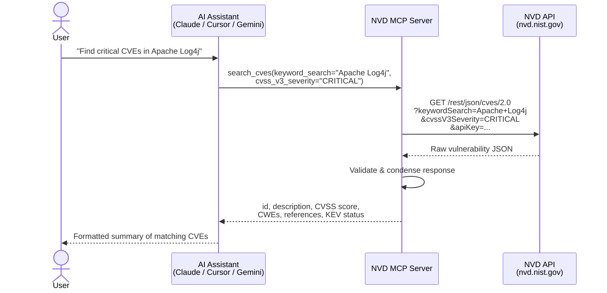

# NVD MCP Server

[](https://github.com/Alig1493/nvd-mcp-server/actions/workflows/test-nvd-api.yml)

A [Model Context Protocol (MCP)](https://modelcontextprotocol.io) server that lets AI assistants like Claude, Cursor, and Gemini search the [National Vulnerability Database (NVD)](https://nvd.nist.gov/) for security vulnerabilities — in plain English, no API knowledge required.

Ask your AI assistant things like:
- *"Find critical CVEs published this month"*
- *"What vulnerabilities affect OpenSSL 3.0.0?"*
- *"Look up Log4Shell"*
- *"Show me high-severity Linux kernel buffer overflow CVEs"*

---

## How it works



The server sits between your AI assistant and the NVD API. It:
1. Receives natural-language-driven tool calls from the AI
2. Translates them into authenticated NVD API requests
3. Validates the raw response against strict data models
4. Returns a clean, condensed result the AI can reason about

---

## Prerequisites

- **Python 3.13+**
- **[uv](https://docs.astral.sh/uv/getting-started/installation/)** — fast Python package manager
- An **NVD API key** (free, takes ~1 hour to receive)

---

## Step 1 — Get an NVD API key

The NVD API is free and open, but an API key increases your rate limit from **5 requests/30 seconds** to **50 requests/30 seconds**.

1. Go to **https://nvd.nist.gov/developers/request-an-api-key**
2. Enter your email address and submit the form
3. Check your email — you'll receive your key within an hour
4. Copy the key, you'll need it in the next step

---

## Step 2 — Install the server

```bash
git clone https://github.com/Alig1493/nvd-mcp-server.git
cd nvd-mcp-server
uv sync
```

---

## Step 3 — Configure your API key

Create a `.env` file in the project root:

```bash
NVD_API_KEY=your-api-key-here
```

That's the only required setting. The NVD API URLs are pre-configured.

---

## Step 4 — Connect to your AI assistant

The server natively supports two connection protocols: Local **`stdio`** pipelines and remote **`Streamable HTTP`** pipelines. Pick your setup mode below:

### Option A: Local Process Setup (stdio)

Great for single-user local workflows where your assistant spawns the backend script directly.

#### Claude Desktop
Open your Claude Desktop config file:


| OS | Path |
|----|------|
| macOS | `~/Library/Application Support/Claude/claude_desktop_config.json` |
| Windows | `%APPDATA%\Claude\claude_desktop_config.json` |

Add the following inside the `"mcpServers"` object:

```json
{
  "mcpServers": {
    "nvd-mcp-server-stdio": {
      "type": "stdio",
      "command": "uv",
      "args": [
        "--directory", "/absolute/path/to/nvd-mcp-server",
        "run", "python", "-m", "nvd_mcp_server.server",
        "--transport", "stdio"
      ],
      "env": {
        "NVD_API_KEY": "your-api-key-here"
      }
    }
  }
}
```
Replace `/absolute/path/to/nvd-mcp-server` with your local repository root.

#### Claude Code (CLI)
Run this once from your terminal:
```bash
claude mcp add nvd-mcp-server \
  --command uv \
  --args "--directory /absolute/path/to/nvd-mcp-server run python -m nvd_mcp_server.server --transport stdio" \
  --env NVD_API_KEY=your-api-key-here
```

#### Cursor
Open Cursor → Settings → MCP, then add a new server with:
* **Name**: `nvd-mcp-server`
* **Type**: `command`
* **Command**: `uv --directory /absolute/path/to/nvd-mcp-server run python -m nvd_mcp_server.server --transport stdio`

---

### Option B: Cloud or Container Setup (Streamable HTTP)

Perfect for shared deployments, team networks, or remote clients. This builds a unified, high-performance bidirectional Streamable HTTP container drop.

**Start the container locally:**
```bash
docker compose up --build -d
```

**Connect your Client Application** using the unified `/mcp` route path endpoint:
```json
{
  "mcpServers": {
    "nvd-mcp-server-http": {
      "type": "http",
      "url": "http://localhost:8000/mcp"
    }
  }
}
```
*(Note: Ensure your environment matches modern `type: "http"` configurations to utilize the single-endpoint stream engine).*

**Custom Manual Port Bindings:**
```bash
docker build -t nvd-mcp-streamable .
docker run -d -p 9090:8000 --env-file .env --name nvd-service nvd-mcp-streamable
```

---

## Smoke Testing the Server Connection

An automated validation script is provided in the repository to check connection loops and query integrations. Run it via your local shell layout:

```bash
# Tests the default local Streamable HTTP pipeline endpoint
uv run scripts/test_http_connection.py

# Tests a custom port/domain routing configuration
uv run scripts/test_http_connection.py --url http://localhost:9090/mcp
```

---

## Example prompts

### Look up a specific CVE

> *"What is CVE-2021-44228?"*


CVE-2021-44228 — Log4Shell
Published: 2021-12-10 | Status: Analyzed
CVSS: 10.0 CRITICAL (CVSSv3.1) | AV:N/AC:L/PR:N/UI:N/S:C/C:H/I:H/A:H

Apache Log4j2 2.0-beta9 through 2.15.0 JNDI features do not protect against
attacker-controlled LDAP endpoints. An attacker who can control log messages
can execute arbitrary code loaded from a remote server.

CWEs: CWE-20, CWE-400, CWE-502, CWE-917
CISA KEV: Added 2021-12-10 · Due 2021-12-24

---

### Find vulnerabilities for a product

> *"What are the critical vulnerabilities affecting OpenSSL 3.0.0?"*

The assistant searches by CPE name and CVSS severity, returning a table of matching CVEs with scores and descriptions.

---

### Search by keyword

> *"Find recent CVEs related to remote code execution in Windows"*

> *"Show me SQL injection vulnerabilities from the last 6 months"*

---

### Filter by severity

> *"List high and critical CVEs published in January 2025"*

> *"Find all CVEs in CISA's Known Exploited Vulnerabilities catalog from Q1 2023"*

---

### Paginate through results

> *"Show me the next page of results"*

Every response includes a `pagination_hint` telling the assistant exactly how many results remain and how to fetch the next page — you never need to think about offsets.

---

## Available filters (reference)


| Filter | What it does | Example value |
|--------|-------------|---------------|
| `cve_id` | Look up a specific CVE | `CVE-2021-44228` |
| `keyword_search` | Search descriptions | `"buffer overflow"` |
| `keyword_exact_match` | Exact phrase match | `true` |
| `cvss_v3_severity` | Filter by CVSSv3 severity | `CRITICAL`, `HIGH`, `MEDIUM`, `LOW` |
| `cvss_v2_severity` | Filter by CVSSv2 severity | `HIGH`, `MEDIUM`, `LOW` |
| `cvss_v3_metrics` | Match a CVSSv3 vector string | `AV:N/AC:L/PR:N/UI:N` |
| `cwe_id` | Filter by weakness type | `CWE-79`, `CWE-89` |
| `cpe_name` | Filter by affected product | `cpe:2.3:a:openssl:openssl:3.0.0:*:*:*:*:*:*:*` |
| `is_vulnerable` | Only confirmed vulnerable configs | `true` (requires `cpe_name`) |
| `virtual_match_string` | Broad product match | `cpe:2.3:o:linux:linux_kernel` |
| `pub_start_date` / `pub_end_date` | Published date range | `2024-01-01T00:00:00.000` |
| `last_mod_start_date` / `last_mod_end_date` | Last modified date range | `2025-01-01T00:00:00.000` |
| `kev_start_date` / `kev_end_date` | CISA KEV addition date range | `2023-01-01T00:00:00.000` |
| `has_kev` | Only KEV catalog CVEs | `true` |
| `no_rejected` | Exclude rejected CVEs | `true` |
| `cve_tag` | Filter by tag | `disputed`, `unsupported-when-assigned` |
| `start_index` | Pagination offset | `10`, `20`, ... |
